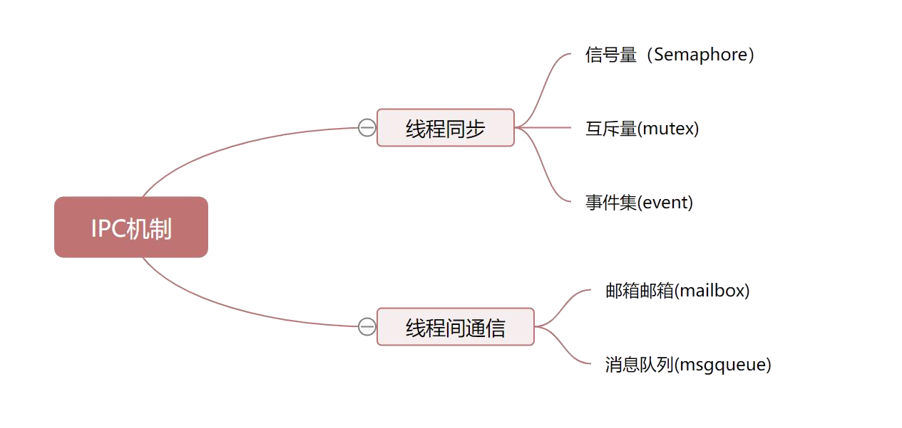

# RT-Thread IPC学习总结

写于2024/8/1 早 有关于线程间同步与线程间通信，大部分都是从官方文档上摘下来的。。。



进程间通信（IPC，InterProcess Communication)是指在不同进程之间传播或交换信息。

IPC的方式通常有管道（包括无名管道和命名管道）、消息队列、信号量、共享存储、Socket、Streams等。其中 Socket和Streams支持不同主机上的两个进程IPC。

通过信号量，互斥量进行通信为低级共享，是基于数据结构的共享，而邮箱，消息队列等是高级共享，基于存储区的通信。

## 线程同步

### 1.信号量

#### 信号量控制块

在 RT-Thread 中，信号量控制块是操作系统用于管理信号量的一个数据结构，由结构体 struct rt_semaphore 表示。另外一种 C 表达方式 rt_sem_t，表示的是信号量的句柄，在 C 语言中的实现是指向信号量控制块的指针。信号量控制块结构的详细定义如下：

```c
struct rt_semaphore
{
   struct rt_ipc_object parent;  /* 继承自 ipc_object 类 */
   rt_uint16_t value;            /* 信号量的值 */
};
/* rt_sem_t 是指向 semaphore 结构体的指针类型 */
typedef struct rt_semaphore* rt_sem_t;复制错误复制成功
```

rt_semaphore 对象从 rt_ipc_object 中派生，由 IPC 容器所管理，信号量的最大值是 65535。

#### 信号量控制方式

信号量控制块中含有信号量相关的重要参数，在信号量各种状态间起到纽带的作用。信号量相关接口如下图所示，对一个信号量的操作包含：创建 / 初始化信号量、获取信号量、释放信号量、删除 / 脱离信号量。


#### 创建和删除信号量

当创建一个信号量时，内核首先创建一个信号量控制块，然后对该控制块进行基本的初始化工作，创建信号量使用下面的函数接口：

```c
 rt_sem_t rt_sem_create(const char *name,
                        rt_uint32_t value,
                        rt_uint8_t flag);
```

当调用这个函数时，系统将先从对象管理器中分配一个 semaphore 对象，并初始化这个对象，然后初始化父类 IPC 对象以及与 semaphore 相关的部分。在创建信号量指定的参数中，信号量标志参数决定了当信号量不可用时，多个线程等待的排队方式。当选择 RT_IPC_FLAG_FIFO（先进先出）方式时，那么等待线程队列将按照先进先出的方式排队，先进入的线程将先获得等待的信号量；当选择 RT_IPC_FLAG_PRIO（优先级等待）方式时，等待线程队列将按照优先级进行排队，优先级高的等待线程将先获得等待的信号量。

PS.RT_IPC_FLAG_FIFO 属于非实时调度方式，除非应用程序非常在意先来后到，并且你清楚地明白所有涉及到该信号量的线程都将会变为非实时线程，方可使用 RT_IPC_FLAG_FIFO，否则建议采用 RT_IPC_FLAG_PRIO，即确保线程的实时性。

下表描述了该函数的输入参数与返回值：

| **参数**           | **描述**                                                     |
| ------------------ | ------------------------------------------------------------ |
| name               | 信号量名称                                                   |
| value              | 信号量初始值                                                 |
| flag               | 信号量标志，它可以取如下数值： RT_IPC_FLAG_FIFO 或 RT_IPC_FLAG_PRIO |
| **返回**           | ——                                                           |
| RT_NULL            | 创建失败                                                     |
| 信号量的控制块指针 | 创建成功                                                     |

系统不再使用信号量时，可通过删除信号量以释放系统资源，适用于动态创建的信号量。删除信号量使用下面的函数接口：

```c
rt_err_t rt_sem_delete(rt_sem_t sem);
```

调用这个函数时，系统将删除这个信号量。如果删除该信号量时，有线程正在等待该信号量，那么删除操作会先唤醒等待在该信号量上的线程（等待线程的返回值是 - RT_ERROR），然后再释放信号量的内存资源。下表描述了该函数的输入参数与返回值：

| **参数** | **描述**                         |
| -------- | -------------------------------- |
| sem      | rt_sem_create() 创建的信号量对象 |
| **返回** | ——                               |
| RT_EOK   | 删除成功                         |

#### 初始化和脱离信号量

对于静态信号量对象，它的内存空间在编译时期就被编译器分配出来，放在读写数据段或未初始化数据段上，此时使用信号量就不再需要使用 rt_sem_create 接口来创建它，而只需在使用前对它进行初始化即可。初始化信号量对象可使用下面的函数接口：

```c
rt_err_t rt_sem_init(rt_sem_t       sem,
                    const char     *name,
                    rt_uint32_t    value,
                    rt_uint8_t     flag)
```

当调用这个函数时，系统将对这个 semaphore 对象进行初始化，然后初始化 IPC 对象以及与 semaphore 相关的部分。信号量标志可用上面创建信号量函数里提到的标志。下表描述了该函数的输入参数与返回值：

| **参数** | **描述**                                                     |
| -------- | ------------------------------------------------------------ |
| sem      | 信号量对象的句柄                                             |
| name     | 信号量名称                                                   |
| value    | 信号量初始值                                                 |
| flag     | 信号量标志，它可以取如下数值： RT_IPC_FLAG_FIFO 或 RT_IPC_FLAG_PRIO |
| **返回** | ——                                                           |
| RT_EOK   | 初始化成功                                                   |

脱离信号量就是让信号量对象从内核对象管理器中脱离，适用于静态初始化的信号量。脱离信号量使用下面的函数接口：

```c
rt_err_t rt_sem_detach(rt_sem_t sem);
```

使用该函数后，内核先唤醒所有挂在该信号量等待队列上的线程，然后将该信号量从内核对象管理器中脱离。原来挂起在信号量上的等待线程将获得 - RT_ERROR 的返回值。下表描述了该函数的输入参数与返回值：

| **参数** | **描述**         |
| -------- | ---------------- |
| sem      | 信号量对象的句柄 |
| **返回** | ——               |
| RT_EOK   | 脱离成功         |

#### 获取信号量

线程通过获取信号量来获得信号量资源实例，当信号量值大于零时，线程将获得信号量，并且相应的信号量值会减 1，获取信号量使用下面的函数接口：

```c
rt_err_t rt_sem_take (rt_sem_t sem, rt_int32_t time);
```

在调用这个函数时，如果信号量的值等于零，那么说明当前信号量资源实例不可用，申请该信号量的线程将根据 time 参数的情况选择直接返回、或挂起等待一段时间、或永久等待，直到其他线程或中断释放该信号量。如果在参数 time 指定的时间内依然得不到信号量，线程将超时返回，返回值是 - RT_ETIMEOUT。下表描述了该函数的输入参数与返回值：

| **参数**     | **描述**                                          |
| ------------ | ------------------------------------------------- |
| sem          | 信号量对象的句柄                                  |
| time         | 指定的等待时间，单位是操作系统时钟节拍（OS Tick） |
| **返回**     | ——                                                |
| RT_EOK       | 成功获得信号量                                    |
| -RT_ETIMEOUT | 超时依然未获得信号量                              |
| -RT_ERROR    | 其他错误                                          |

#### 无等待获取信号量

当用户不想在申请的信号量上挂起线程进行等待时，可以使用无等待方式获取信号量，无等待获取信号量使用下面的函数接口：

```c
rt_err_t rt_sem_trytake(rt_sem_t sem);
```

这个函数与 `rt_sem_take(sem, RT_WAITING_NO)` 的作用相同，即当线程申请的信号量资源实例不可用的时候，它不会等待在该信号量上，而是直接返回 - RT_ETIMEOUT。下表描述了该函数的输入参数与返回值：

| **参数**     | **描述**         |
| ------------ | ---------------- |
| sem          | 信号量对象的句柄 |
| **返回**     | ——               |
| RT_EOK       | 成功获得信号量   |
| -RT_ETIMEOUT | 获取失败         |

#### 释放信号量

释放信号量可以唤醒挂起在该信号量上的线程。释放信号量使用下面的函数接口：

```c
rt_err_t rt_sem_release(rt_sem_t sem);
```

例如当信号量的值等于零时，并且有线程等待这个信号量时，释放信号量将唤醒等待在该信号量线程队列中的第一个线程，由它获取信号量；否则将把信号量的值加 1。下表描述了该函数的输入参数与返回值：

| **参数** | **描述**         |
| -------- | ---------------- |
| sem      | 信号量对象的句柄 |
| **返回** | ——               |
| RT_EOK   | 成功释放信号量   |

### 2.互斥量

互斥量与信号量原理基本一致，只不过互斥量的初始数值为1。在RT-Thread中，使用互斥量要注意**优先级翻转问题**

所谓优先级翻转，即当一个高优先级线程试图通过信号量机制访问共享资源时，如果该信号量已被一低优先级线程持有，而这个低优先级线程在运行过程中可能又被其它一些中等优先级的线程抢占，因此造成高优先级线程被许多具有较低优先级的线程阻塞，实时性难以得到保证。如下图所示：有优先级为 A、B 和 C 的三个线程，优先级 A> B > C。线程 A，B 处于挂起状态，等待某一事件触发，线程 C 正在运行，此时线程 C 开始使用某一共享资源 M。在使用过程中，线程 A 等待的事件到来，线程 A 转为就绪态，因为它比线程 C 优先级高，所以立即执行。但是当线程 A 要使用共享资源 M 时，由于其正在被线程 C 使用，因此线程 A 被挂起切换到线程 C 运行。如果此时线程 B 等待的事件到来，则线程 B 转为就绪态。由于线程 B 的优先级比线程 C 高，且线程B没有用到共享资源 M ，因此线程 B 开始运行，直到其运行完毕，线程 C 才开始运行。只有当线程 C 释放共享资源 M 后，线程 A 才得以执行。在这种情况下，优先级发生了翻转：线程 B 先于线程 A 运行。这样便不能保证高优先级线程的响应时间。


在 RT-Thread 操作系统中，互斥量可以解决优先级翻转问题，实现的是优先级继承协议 (Sha, 1990)。优先级继承是通过在线程 A 尝试获取共享资源而被挂起的期间内，将线程 C 的优先级提升到线程 A 的优先级别，从而解决优先级翻转引起的问题。这样能够防止 C（间接地防止 A）被 B 抢占，如下图所示。优先级继承是指，提高某个占有某种资源的低优先级线程的优先级，使之与所有等待该资源的线程中优先级最高的那个线程的优先级相等，然后执行，而当这个低优先级线程释放该资源时，优先级重新回到初始设定。因此，继承优先级的线程避免了系统资源被任何中间优先级的线程抢占。


#### 互斥量控制块

在 RT-Thread 中，互斥量控制块是操作系统用于管理互斥量的一个数据结构，由结构体 struct rt_mutex 表示。另外一种 C 表达方式 rt_mutex_t，表示的是互斥量的句柄，在 C 语言中的实现是指互斥量控制块的指针。互斥量控制块结构的详细定义请见以下代码：

```c
struct rt_mutex
    {
        struct rt_ipc_object parent;                /* 继承自 ipc_object 类 */

        rt_uint16_t          value;                   /* 互斥量的值 */
        rt_uint8_t           original_priority;     /* 持有线程的原始优先级 */
        rt_uint8_t           hold;                     /* 持有线程的持有次数   */
        struct rt_thread    *owner;                 /* 当前拥有互斥量的线程 */
    };
    /* rt_mutext_t 为指向互斥量结构体的指针类型  */
    typedef struct rt_mutex* rt_mutex_t;
```

rt_mutex 对象从 rt_ipc_object 中派生，由 IPC 容器所管理。

#### 互斥量的管理方式

互斥量控制块中含有互斥相关的重要参数，在互斥量功能的实现中起到重要的作用。互斥量相关接口如下图所示，对一个互斥量的操作包含：创建 / 初始化互斥量、获取互斥量、释放互斥量、删除 / 脱离互斥量。


#### 创建和删除互斥量

创建一个互斥量时，内核首先创建一个互斥量控制块，然后完成对该控制块的初始化工作。创建互斥量使用下面的函数接口：

```c
rt_mutex_t rt_mutex_create (const char* name, rt_uint8_t flag);
```

可以调用 rt_mutex_create 函数创建一个互斥量，它的名字由 name 所指定。当调用这个函数时，系统将先从对象管理器中分配一个 mutex 对象，并初始化这个对象，然后初始化父类 IPC 对象以及与 mutex 相关的部分。互斥量的 flag 标志已经作废，无论用户选择 RT_IPC_FLAG_PRIO 还是 RT_IPC_FLAG_FIFO，内核均按照 RT_IPC_FLAG_PRIO 处理。下表描述了该函数的输入参数与返回值：

| **参数**   | **描述**                                                     |
| ---------- | ------------------------------------------------------------ |
| name       | 互斥量的名称                                                 |
| flag       | 该标志已经作废，无论用户选择 RT_IPC_FLAG_PRIO 还是 RT_IPC_FLAG_FIFO，内核均按照 RT_IPC_FLAG_PRIO 处理 |
| **返回**   | ——                                                           |
| 互斥量句柄 | 创建成功                                                     |
| RT_NULL    | 创建失败                                                     |

当不再使用互斥量时，通过删除互斥量以释放系统资源，适用于动态创建的互斥量。删除互斥量使用下面的函数接口：

```c
rt_err_t rt_mutex_delete (rt_mutex_t mutex);
```

当删除一个互斥量时，所有等待此互斥量的线程都将被唤醒，等待线程获得的返回值是 - RT_ERROR。然后系统将该互斥量从内核对象管理器链表中删除并释放互斥量占用的内存空间。下表描述了该函数的输入参数与返回值：

| **参数** | **描述**         |
| -------- | ---------------- |
| mutex    | 互斥量对象的句柄 |
| **返回** | ——               |
| RT_EOK   | 删除成功         |

#### 初始化和脱离互斥量

静态互斥量对象的内存是在系统编译时由编译器分配的，一般放于读写数据段或未初始化数据段中。在使用这类静态互斥量对象前，需要先进行初始化。初始化互斥量使用下面的函数接口：

```c
rt_err_t rt_mutex_init (rt_mutex_t mutex, const char* name, rt_uint8_t flag);
```

使用该函数接口时，需指定互斥量对象的句柄（即指向互斥量控制块的指针），互斥量名称以及互斥量标志。互斥量标志可用上面创建互斥量函数里提到的标志。下表描述了该函数的输入参数与返回值：

| **参数** | **描述**                                                     |
| -------- | ------------------------------------------------------------ |
| mutex    | 互斥量对象的句柄，它由用户提供，并指向互斥量对象的内存块     |
| name     | 互斥量的名称                                                 |
| flag     | 该标志已经作废，无论用户选择 RT_IPC_FLAG_PRIO 还是 RT_IPC_FLAG_FIFO，内核均按照 RT_IPC_FLAG_PRIO 处理 |
| **返回** | ——                                                           |
| RT_EOK   | 初始化成功                                                   |

脱离互斥量将把互斥量对象从内核对象管理器中脱离，适用于静态初始化的互斥量。脱离互斥量使用下面的函数接口：

```c
rt_err_t rt_mutex_detach (rt_mutex_t mutex);
```

使用该函数接口后，内核先唤醒所有挂在该互斥量上的线程（线程的返回值是 -RT_ERROR），然后系统将该互斥量从内核对象管理器中脱离。下表描述了该函数的输入参数与返回值：

| **参数** | **描述**         |
| -------- | ---------------- |
| mutex    | 互斥量对象的句柄 |
| **返回** | ——               |
| RT_EOK   | 成功             |

#### 获取互斥量

线程获取了互斥量，那么线程就有了对该互斥量的所有权，即某一个时刻一个互斥量只能被一个线程持有。获取互斥量使用下面的函数接口：

```c
rt_err_t rt_mutex_take (rt_mutex_t mutex, rt_int32_t time);
```

如果互斥量没有被其他线程控制，那么申请该互斥量的线程将成功获得该互斥量。如果互斥量已经被当前线程线程控制，则该互斥量的持有计数加 1，当前线程也不会挂起等待。如果互斥量已经被其他线程占有，则当前线程在该互斥量上挂起等待，直到其他线程释放它或者等待时间超过指定的超时时间。下表描述了该函数的输入参数与返回值：

| **参数**     | **描述**         |
| ------------ | ---------------- |
| mutex        | 互斥量对象的句柄 |
| time         | 指定等待的时间   |
| **返回**     | ——               |
| RT_EOK       | 成功获得互斥量   |
| -RT_ETIMEOUT | 超时             |
| -RT_ERROR    | 获取失败         |

#### 无等待获取互斥量

当用户不想在申请的互斥量上挂起线程进行等待时，可以使用无等待方式获取互斥量，无等待获取互斥量使用下面的函数接口：

```c
rt_err_t rt_mutex_trytake(rt_mutex_t mutex);
```

这个函数与 `rt_mutex_take(mutex, RT_WAITING_NO)` 的作用相同，即当线程申请的互斥量资源实例不可用的时候，它不会等待在该互斥量上，而是直接返回 - RT_ETIMEOUT。下表描述了该函数的输入参数与返回值：

| **参数**     | **描述**         |
| ------------ | ---------------- |
| mutex        | 互斥量对象的句柄 |
| **返回**     | ——               |
| RT_EOK       | 成功获得互斥量   |
| -RT_ETIMEOUT | 获取失败         |

#### 释放互斥量

当线程完成互斥资源的访问后，应尽快释放它占据的互斥量，使得其他线程能及时获取该互斥量。释放互斥量使用下面的函数接口：

```c
rt_err_t rt_mutex_release(rt_mutex_t mutex);
```

使用该函数接口时，只有已经拥有互斥量控制权的线程才能释放它，每释放一次该互斥量，它的持有计数就减 1。当该互斥量的持有计数为零时（即持有线程已经释放所有的持有操作），它变为可用，等待在该互斥量上的线程将被唤醒。如果线程的运行优先级被互斥量提升，那么当互斥量被释放后，线程恢复为持有互斥量前的优先级。下表描述了该函数的输入参数与返回值：

| **参数** | **描述**         |
| -------- | ---------------- |
| mutex    | 互斥量对象的句柄 |
| **返回** | ——               |
| RT_EOK   | 成功             |

### 3.事件集

#### 事件集工作机制

事件集主要用于线程间的同步，与信号量不同，它的特点是可以实现一对多，多对多的同步。即一个线程与多个事件的关系可设置为：其中任意一个事件唤醒线程，或几个事件都到达后才唤醒线程进行后续的处理；同样，事件也可以是多个线程同步多个事件。这种多个事件的集合可以用一个 32 位无符号整型变量来表示，变量的每一位代表一个事件，线程通过 “逻辑与” 或“逻辑或”将一个或多个事件关联起来，形成事件组合。事件的 “逻辑或” 也称为是独立型同步，指的是线程与任何事件之一发生同步；事件 “逻辑与” 也称为是关联型同步，指的是线程与若干事件都发生同步。

RT-Thread 定义的事件集有以下特点：

1）事件只与线程相关，事件间相互独立：每个线程可拥有 32 个事件标志，采用一个 32 bit 无符号整型数进行记录，每一个 bit 代表一个事件；

2）事件仅用于同步，不提供数据传输功能；

3）事件无排队性，即多次向线程发送同一事件 (如果线程还未来得及读走)，其效果等同于只发送一次。

在 RT-Thread 中，每个线程都拥有一个事件信息标记，它有三个属性，分别是 RT_EVENT_FLAG_AND(逻辑与)，RT_EVENT_FLAG_OR(逻辑或）以及 RT_EVENT_FLAG_CLEAR(清除标记）。当线程等待事件同步时，可以通过 32 个事件标志和这个事件信息标记来判断当前接收的事件是否满足同步条件。


如上图所示，线程 #1 的事件标志中第 1 位和第 30 位被置位，如果事件信息标记位设为逻辑与，则表示线程 #1 只有在事件 1 和事件 30 都发生以后才会被触发唤醒，如果事件信息标记位设为逻辑或，则事件 1 或事件 30 中的任意一个发生都会触发唤醒线程 #1。如果信息标记同时设置了清除标记位，则当线程 #1 唤醒后将主动把事件 1 和事件 30 清为零，否则事件标志将依然存在（即置 1）。

#### 事件集控制块

在 RT-Thread 中，事件集控制块是操作系统用于管理事件的一个数据结构，由结构体 struct rt_event 表示。另外一种 C 表达方式 rt_event_t，表示的是事件集的句柄，在 C 语言中的实现是事件集控制块的指针。事件集控制块结构的详细定义请见以下代码：

```c
struct rt_event
{
    struct rt_ipc_object parent;    /* 继承自 ipc_object 类 */

    /* 事件集合，每一 bit 表示 1 个事件，bit 位的值可以标记某事件是否发生 */
    rt_uint32_t set;
};
/* rt_event_t 是指向事件结构体的指针类型  */
typedef struct rt_event* rt_event_t;
```

rt_event 对象从 rt_ipc_object 中派生，由 IPC 容器所管理。

#### 事件集的管理方式

事件集控制块中含有与事件集相关的重要参数，在事件集功能的实现中起重要的作用。事件集相关接口如下图所示，对一个事件集的操作包含：创建 / 初始化事件集、发送事件、接收事件、删除 / 脱离事件集。


#### 创建和删除事件集

当创建一个事件集时，内核首先创建一个事件集控制块，然后对该事件集控制块进行基本的初始化，创建事件集使用下面的函数接口：

```c
rt_event_t rt_event_create(const char* name, rt_uint8_t flag);
```

调用该函数接口时，系统会从对象管理器中分配事件集对象，并初始化这个对象，然后初始化父类 IPC 对象。下表描述了该函数的输入参数与返回值：

| **参数**       | **描述**                                                     |
| -------------- | ------------------------------------------------------------ |
| name           | 事件集的名称                                                 |
| flag           | 事件集的标志，它可以取如下数值： RT_IPC_FLAG_FIFO 或 RT_IPC_FLAG_PRIO |
| **返回**       | ——                                                           |
| RT_NULL        | 创建失败                                                     |
| 事件对象的句柄 | 创建成功                                                     |

系统不再使用 rt_event_create() 创建的事件集对象时，通过删除事件集对象控制块来释放系统资源。删除事件集可以使用下面的函数接口：

```c
rt_err_t rt_event_delete(rt_event_t event);
```

在调用 rt_event_delete 函数删除一个事件集对象时，应该确保该事件集不再被使用。在删除前会唤醒所有挂起在该事件集上的线程（线程的返回值是 - RT_ERROR），然后释放事件集对象占用的内存块。下表描述了该函数的输入参数与返回值：

| **参数** | **描述**         |
| -------- | ---------------- |
| event    | 事件集对象的句柄 |
| **返回** | ——               |
| RT_EOK   | 成功             |

#### 初始化和脱离事件集

静态事件集对象的内存是在系统编译时由编译器分配的，一般放于读写数据段或未初始化数据段中。在使用静态事件集对象前，需要先行对它进行初始化操作。初始化事件集使用下面的函数接口：

```c
rt_err_t rt_event_init(rt_event_t event, const char* name, rt_uint8_t flag);
```

调用该接口时，需指定静态事件集对象的句柄（即指向事件集控制块的指针），然后系统会初始化事件集对象，并加入到系统对象容器中进行管理。下表描述了该函数的输入参数与返回值：

| **参数** | **描述**                                                     |
| -------- | ------------------------------------------------------------ |
| event    | 事件集对象的句柄                                             |
| name     | 事件集的名称                                                 |
| flag     | 事件集的标志，它可以取如下数值： RT_IPC_FLAG_FIFO 或 RT_IPC_FLAG_PRIO |
| **返回** | ——                                                           |
| RT_EOK   | 成功                                                         |

系统不再使用 rt_event_init() 初始化的事件集对象时，通过脱离事件集对象控制块来释放系统资源。脱离事件集是将事件集对象从内核对象管理器中脱离。脱离事件集使用下面的函数接口：

```c
rt_err_t rt_event_detach(rt_event_t event);
```

用户调用这个函数时，系统首先唤醒所有挂在该事件集等待队列上的线程（线程的返回值是 - RT_ERROR），然后将该事件集从内核对象管理器中脱离。下表描述了该函数的输入参数与返回值：

| **参数** | **描述**         |
| -------- | ---------------- |
| event    | 事件集对象的句柄 |
| **返回** | ——               |
| RT_EOK   | 成功             |

#### 发送事件

发送事件函数可以发送事件集中的一个或多个事件，如下：

```c
rt_err_t rt_event_send(rt_event_t event, rt_uint32_t set);
```

使用该函数接口时，通过参数 set 指定的事件标志来设定 event 事件集对象的事件标志值，然后遍历等待在 event 事件集对象上的等待线程链表，判断是否有线程的事件激活要求与当前 event 对象事件标志值匹配，如果有，则唤醒该线程。下表描述了该函数的输入参数与返回值：

| **参数** | **描述**                     |
| -------- | ---------------------------- |
| event    | 事件集对象的句柄             |
| set      | 发送的一个或多个事件的标志值 |
| **返回** | ——                           |
| RT_EOK   | 成功                         |

#### 接收事件

内核使用 32 位的无符号整数来标识事件集，它的每一位代表一个事件，因此一个事件集对象可同时等待接收 32 个事件，内核可以通过指定选择参数 “逻辑与” 或“逻辑或”来选择如何激活线程，使用 “逻辑与” 参数表示只有当所有等待的事件都发生时才激活线程，而使用 “逻辑或” 参数则表示只要有一个等待的事件发生就激活线程。接收事件使用下面的函数接口：

```c
rt_err_t rt_event_recv(rt_event_t event,
                           rt_uint32_t set,
                           rt_uint8_t option,
                           rt_int32_t timeout,
                           rt_uint32_t* recved);
```

当用户调用这个接口时，系统首先根据 set 参数和接收选项 option 来判断它要接收的事件是否发生，如果已经发生，则根据参数 option 上是否设置有 RT_EVENT_FLAG_CLEAR 来决定是否重置事件的相应标志位，然后返回（其中 recved 参数返回接收到的事件）；如果没有发生，则把等待的 set 和 option 参数填入线程本身的结构中，然后把线程挂起在此事件上，直到其等待的事件满足条件或等待时间超过指定的超时时间。如果超时时间设置为零，则表示当线程要接受的事件没有满足其要求时就不等待，而直接返回 - RT_ETIMEOUT。下表描述了该函数的输入参数与返回值：

| **参数**     | **描述**             |
| ------------ | -------------------- |
| event        | 事件集对象的句柄     |
| set          | 接收线程感兴趣的事件 |
| option       | 接收选项             |
| timeout      | 指定超时时间         |
| recved       | 指向接收到的事件     |
| **返回**     | ——                   |
| RT_EOK       | 成功                 |
| -RT_ETIMEOUT | 超时                 |
| -RT_ERROR    | 错误                 |

option 的值可取：

```c
/* 选择 逻辑与 或 逻辑或 的方式接收事件 */
RT_EVENT_FLAG_OR
RT_EVENT_FLAG_AND

/* 选择清除重置事件标志位 */
RT_EVENT_FLAG_CLEAR
```

## 线程间通信

### 邮箱

#### 邮箱控制块

在 RT-Thread 中，邮箱控制块是操作系统用于管理邮箱的一个数据结构，由结构体 struct rt_mailbox 表示。另外一种 C 表达方式 rt_mailbox_t，表示的是邮箱的句柄，在 C 语言中的实现是邮箱控制块的指针。邮箱控制块结构的详细定义请见以下代码：

```c
struct rt_mailbox
{
    struct rt_ipc_object parent;

    rt_uint32_t* msg_pool;                /* 邮箱缓冲区的开始地址 */
    rt_uint16_t size;                     /* 邮箱缓冲区的大小     */

    rt_uint16_t entry;                    /* 邮箱中邮件的数目     */
    rt_uint16_t in_offset, out_offset;    /* 邮箱缓冲的进出指针   */
    rt_list_t suspend_sender_thread;      /* 发送线程的挂起等待队列 */
};
typedef struct rt_mailbox* rt_mailbox_t;
```

rt_mailbox 对象从 rt_ipc_object 中派生，由 IPC 容器所管理。

#### 邮箱的管理方式

邮箱控制块是一个结构体，其中含有事件相关的重要参数，在邮箱的功能实现中起重要的作用。邮箱的相关接口如下图所示，对一个邮箱的操作包含：创建 / 初始化邮箱、发送邮件、接收邮件、删除 / 脱离邮箱。


#### 创建和删除邮箱

动态创建一个邮箱对象可以调用如下的函数接口：

```c
rt_mailbox_t rt_mb_create (const char* name, rt_size_t size, rt_uint8_t flag);
```

创建邮箱对象时会先从对象管理器中分配一个邮箱对象，然后给邮箱动态分配一块内存空间用来存放邮件，这块内存的大小等于邮件大小（4 字节）与邮箱容量的乘积，接着初始化接收邮件数目和发送邮件在邮箱中的偏移量。下表描述了该函数的输入参数与返回值：

| **参数**       | **描述**                                                     |
| -------------- | ------------------------------------------------------------ |
| name           | 邮箱名称                                                     |
| size           | 邮箱容量                                                     |
| flag           | 邮箱标志，它可以取如下数值： RT_IPC_FLAG_FIFO 或 RT_IPC_FLAG_PRIO |
| **返回**       | ——                                                           |
| RT_NULL        | 创建失败                                                     |
| 邮箱对象的句柄 | 创建成功                                                     |

当用 rt_mb_create() 创建的邮箱不再被使用时，应该删除它来释放相应的系统资源，一旦操作完成，邮箱将被永久性的删除。删除邮箱的函数接口如下：

rt_err_t rt_mb_delete (rt_mailbox_t mb);复制错误复制成功

删除邮箱时，如果有线程被挂起在该邮箱对象上，内核先唤醒挂起在该邮箱上的所有线程（线程返回值是 -RT_ERROR），然后再释放邮箱使用的内存，最后删除邮箱对象。下表描述了该函数的输入参数与返回值：

| **参数** | **描述**       |
| -------- | -------------- |
| mb       | 邮箱对象的句柄 |
| **返回** | ——             |
| RT_EOK   | 成功           |

#### 初始化和脱离邮箱

初始化邮箱跟创建邮箱类似，只是初始化邮箱用于静态邮箱对象的初始化。与创建邮箱不同的是，静态邮箱对象的内存是在系统编译时由编译器分配的，一般放于读写数据段或未初始化数据段中，其余的初始化工作与创建邮箱时相同。函数接口如下：

```c
  rt_err_t rt_mb_init(rt_mailbox_t mb,
                    const char* name,
                    void* msgpool,
                    rt_size_t size,
                    rt_uint8_t flag)
```

初始化邮箱时，该函数接口需要获得用户已经申请获得的邮箱对象控制块，缓冲区的指针，以及邮箱名称和邮箱容量（能够存储的邮件数）。下表描述了该函数的输入参数与返回值：

| **参数** | **描述**                                                     |
| -------- | ------------------------------------------------------------ |
| mb       | 邮箱对象的句柄                                               |
| name     | 邮箱名称                                                     |
| msgpool  | 缓冲区指针                                                   |
| size     | 邮箱容量                                                     |
| flag     | 邮箱标志，它可以取如下数值： RT_IPC_FLAG_FIFO 或 RT_IPC_FLAG_PRIO |
| **返回** | ——                                                           |
| RT_EOK   | 成功                                                         |

这里的 size 参数指定的是邮箱的容量，即如果 msgpool 指向的缓冲区的字节数是 N，那么邮箱容量应该是 N/4。

脱离邮箱将把静态初始化的邮箱对象从内核对象管理器中脱离。脱离邮箱使用下面的接口：

```c
rt_err_t rt_mb_detach(rt_mailbox_t mb);
```

使用该函数接口后，内核先唤醒所有挂在该邮箱上的线程（线程获得返回值是 - RT_ERROR），然后将该邮箱对象从内核对象管理器中脱离。下表描述了该函数的输入参数与返回值：

| **参数** | **描述**       |
| -------- | -------------- |
| mb       | 邮箱对象的句柄 |
| **返回** | ——             |
| RT_EOK   | 成功           |

#### 发送邮件

线程或者中断服务程序可以通过邮箱给其他线程发送邮件，发送邮件函数接口如下：

```c
rt_err_t rt_mb_send (rt_mailbox_t mb, rt_uint32_t value);
```

发送的邮件可以是 32 位任意格式的数据，一个整型值或者一个指向缓冲区的指针。当邮箱中的邮件已经满时，发送邮件的线程或者中断程序会收到 -RT_EFULL 的返回值。下表描述了该函数的输入参数与返回值：

| **参数**  | **描述**       |
| --------- | -------------- |
| mb        | 邮箱对象的句柄 |
| value     | 邮件内容       |
| **返回**  | ——             |
| RT_EOK    | 发送成功       |
| -RT_EFULL | 邮箱已经满了   |

#### 等待方式发送邮件

用户也可以通过如下的函数接口向指定邮箱发送邮件：

```c
rt_err_t rt_mb_send_wait (rt_mailbox_t mb,
                      rt_uint32_t value,
                      rt_int32_t timeout);
```

rt_mb_send_wait() 与 rt_mb_send() 的区别在于有等待时间，如果邮箱已经满了，那么发送线程将根据设定的 timeout 参数等待邮箱中因为收取邮件而空出空间。如果设置的超时时间到达依然没有空出空间，这时发送线程将被唤醒并返回错误码。下表描述了该函数的输入参数与返回值：

| **参数**     | **描述**       |
| ------------ | -------------- |
| mb           | 邮箱对象的句柄 |
| value        | 邮件内容       |
| timeout      | 超时时间       |
| **返回**     | ——             |
| RT_EOK       | 发送成功       |
| -RT_ETIMEOUT | 超时           |
| -RT_ERROR    | 失败，返回错误 |

#### 发送紧急邮件

发送紧急邮件的过程与发送邮件几乎一样，唯一的不同是，当发送紧急邮件时，邮件被直接插队放入了邮件队首，这样，接收者就能够优先接收到紧急邮件，从而及时进行处理。发送紧急邮件的函数接口如下：

```c
rt_err_t rt_mb_urgent (rt_mailbox_t mb, rt_ubase_t value);
```

下表描述了该函数的输入参数与返回值：

| **参数**  | **描述**       |
| --------- | -------------- |
| mb        | 邮箱对象的句柄 |
| value     | 邮件内容       |
| **返回**  | ——             |
| RT_EOK    | 发送成功       |
| -RT_EFULL | 邮箱已满       |

#### 接收邮件

只有当接收者接收的邮箱中有邮件时，接收者才能立即取到邮件并返回 RT_EOK 的返回值，否则接收线程会根据超时时间设置，或挂起在邮箱的等待线程队列上，或直接返回。接收邮件函数接口如下：

```c
rt_err_t rt_mb_recv (rt_mailbox_t mb, rt_uint32_t* value, rt_int32_t timeout);
```

接收邮件时，接收者需指定接收邮件的邮箱句柄，并指定接收到的邮件存放位置以及最多能够等待的超时时间。如果接收时设定了超时，当指定的时间内依然未收到邮件时，将返回 - RT_ETIMEOUT。下表描述了该函数的输入参数与返回值：

| **参数**     | **描述**       |
| ------------ | -------------- |
| mb           | 邮箱对象的句柄 |
| value        | 邮件内容       |
| timeout      | 超时时间       |
| **返回**     | ——             |
| RT_EOK       | 接收成功       |
| -RT_ETIMEOUT | 超时           |
| -RT_ERROR    | 失败，返回错误 |

### 消息队列

消息队列与邮箱区别不大，主要区别在于邮箱传递的信息为4字节固定大小，消息队列可自己设置信息大小。

#### 消息队列控制块

在 RT-Thread 中，消息队列控制块是操作系统用于管理消息队列的一个数据结构，由结构体 struct rt_messagequeue 表示。另外一种 C 表达方式 rt_mq_t，表示的是消息队列的句柄，在 C 语言中的实现是消息队列控制块的指针。消息队列控制块结构的详细定义请见以下代码：

```c
struct rt_messagequeue
{
    struct rt_ipc_object parent;

    void* msg_pool;                     /* 指向存放消息的缓冲区的指针 */

    rt_uint16_t msg_size;               /* 每个消息的长度 */
    rt_uint16_t max_msgs;               /* 最大能够容纳的消息数 */

    rt_uint16_t entry;                  /* 队列中已有的消息数 */

    void* msg_queue_head;               /* 消息链表头 */
    void* msg_queue_tail;               /* 消息链表尾 */
    void* msg_queue_free;               /* 空闲消息链表 */

    rt_list_t suspend_sender_thread;    /* 发送线程的挂起等待队列 */
};
typedef struct rt_messagequeue* rt_mq_t;复制错误复制成功
```

rt_messagequeue 对象从 rt_ipc_object 中派生，由 IPC 容器所管理。

#### 消息队列的管理方式

消息队列控制块是一个结构体，其中含有消息队列相关的重要参数，在消息队列的功能实现中起重要的作用。消息队列的相关接口如下图所示，对一个消息队列的操作包含：创建消息队列 - 发送消息 - 接收消息 - 删除消息队列。


#### 创建和删除消息队列

消息队列在使用前，应该被创建出来，或对已有的静态消息队列对象进行初始化，创建消息队列的函数接口如下所示：

```c
rt_mq_t rt_mq_create(const char* name, rt_size_t msg_size,
            rt_size_t max_msgs, rt_uint8_t flag);
```

创建消息队列时先从对象管理器中分配一个消息队列对象，然后给消息队列对象分配一块内存空间，组织成空闲消息链表，这块内存的大小 =[消息大小 + 消息头（用于链表连接）的大小]X 消息队列最大个数，接着再初始化消息队列，此时消息队列为空。下表描述了该函数的输入参数与返回值：

| **参数**           | **描述**                                                     |
| ------------------ | ------------------------------------------------------------ |
| name               | 消息队列的名称                                               |
| msg_size           | 消息队列中一条消息的最大长度，单位字节                       |
| max_msgs           | 消息队列的最大个数                                           |
| flag               | 消息队列采用的等待方式，它可以取如下数值： RT_IPC_FLAG_FIFO 或 RT_IPC_FLAG_PRIO |
| **返回**           | ——                                                           |
| RT_EOK             | 发送成功                                                     |
| 消息队列对象的句柄 | 成功                                                         |
| RT_NULL            | 失败                                                         |

当消息队列不再被使用时，应该删除它以释放系统资源，一旦操作完成，消息队列将被永久性地删除。删除消息队列的函数接口如下：

```c
rt_err_t rt_mq_delete(rt_mq_t mq);
```

删除消息队列时，如果有线程被挂起在该消息队列等待队列上，则内核先唤醒挂起在该消息等待队列上的所有线程（线程返回值是 - RT_ERROR），然后再释放消息队列使用的内存，最后删除消息队列对象。下表描述了该函数的输入参数与返回值：

| **参数** | **描述**           |
| -------- | ------------------ |
| mq       | 消息队列对象的句柄 |
| **返回** | ——                 |
| RT_EOK   | 成功               |

#### 初始化和脱离消息队列

初始化静态消息队列对象跟创建消息队列对象类似，只是静态消息队列对象的内存是在系统编译时由编译器分配的，一般放于读数据段或未初始化数据段中。在使用这类静态消息队列对象前，需要进行初始化。初始化消息队列对象的函数接口如下：

```c
rt_err_t rt_mq_init(rt_mq_t mq, const char* name,
                        void *msgpool, rt_size_t msg_size,
                        rt_size_t pool_size, rt_uint8_t flag);
```

初始化消息队列时，该接口需要用户已经申请获得的消息队列对象的句柄（即指向消息队列对象控制块的指针）、消息队列名、消息缓冲区指针、消息大小以及消息队列缓冲区大小。消息队列初始化后所有消息都挂在空闲消息链表上，消息队列为空。下表描述了该函数的输入参数与返回值：

| **参数**  | **描述**                                                     |
| --------- | ------------------------------------------------------------ |
| mq        | 消息队列对象的句柄                                           |
| name      | 消息队列的名称                                               |
| msgpool   | 指向存放消息的缓冲区的指针                                   |
| msg_size  | 消息队列中一条消息的最大长度，单位字节                       |
| pool_size | 存放消息的缓冲区大小                                         |
| flag      | 消息队列采用的等待方式，它可以取如下数值： RT_IPC_FLAG_FIFO 或 RT_IPC_FLAG_PRIO |
| **返回**  | ——                                                           |
| RT_EOK    | 成功                                                         |

脱离消息队列将使消息队列对象被从内核对象管理器中脱离。脱离消息队列使用下面的接口：

```c
rt_err_t rt_mq_detach(rt_mq_t mq);
```

使用该函数接口后，内核先唤醒所有挂在该消息等待队列对象上的线程（线程返回值是 -RT_ERROR），然后将该消息队列对象从内核对象管理器中脱离。下表描述了该函数的输入参数与返回值：

| **参数** | **描述**           |
| -------- | ------------------ |
| mq       | 消息队列对象的句柄 |
| **返回** | ——                 |
| RT_EOK   | 成功               |

#### 发送消息

线程或者中断服务程序都可以给消息队列发送消息。当发送消息时，消息队列对象先从空闲消息链表上取下一个空闲消息块，把线程或者中断服务程序发送的消息内容复制到消息块上，然后把该消息块挂到消息队列的尾部。当且仅当空闲消息链表上有可用的空闲消息块时，发送者才能成功发送消息；当空闲消息链表上无可用消息块，说明消息队列已满，此时，发送消息的的线程或者中断程序会收到一个错误码（-RT_EFULL）。发送消息的函数接口如下：

```c
rt_err_t rt_mq_send (rt_mq_t mq, void* buffer, rt_size_t size);
```

发送消息时，发送者需指定发送的消息队列的对象句柄（即指向消息队列控制块的指针），并且指定发送的消息内容以及消息大小。在发送一个普通消息之后，空闲消息链表上的队首消息被转移到了消息队列尾。下表描述了该函数的输入参数与返回值：

| **参数**  | **描述**                                             |
| --------- | ---------------------------------------------------- |
| mq        | 消息队列对象的句柄                                   |
| buffer    | 消息内容                                             |
| size      | 消息大小                                             |
| **返回**  | ——                                                   |
| RT_EOK    | 成功                                                 |
| -RT_EFULL | 消息队列已满                                         |
| -RT_ERROR | 失败，表示发送的消息长度大于消息队列中消息的最大长度 |

#### 等待方式发送消息

用户也可以通过如下的函数接口向指定的消息队列中发送消息：

```c
rt_err_t rt_mq_send_wait(rt_mq_t     mq,
                         const void *buffer,
                         rt_size_t   size,
                         rt_int32_t  timeout);
```

rt_mq_send_wait() 与 rt_mq_send() 的区别在于有等待时间，如果消息队列已经满了，那么发送线程将根据设定的 timeout 参数进行等待。如果设置的超时时间到达依然没有空出空间，这时发送线程将被唤醒并返回错误码。下表描述了该函数的输入参数与返回值：

| **参数**  | **描述**                                             |
| --------- | ---------------------------------------------------- |
| mq        | 消息队列对象的句柄                                   |
| buffer    | 消息内容                                             |
| size      | 消息大小                                             |
| timeout   | 超时时间                                             |
| **返回**  | ——                                                   |
| RT_EOK    | 成功                                                 |
| -RT_EFULL | 消息队列已满                                         |
| -RT_ERROR | 失败，表示发送的消息长度大于消息队列中消息的最大长度 |

#### 发送紧急消息

发送紧急消息的过程与发送消息几乎一样，唯一的不同是，当发送紧急消息时，从空闲消息链表上取下来的消息块不是挂到消息队列的队尾，而是挂到队首，这样，接收者就能够优先接收到紧急消息，从而及时进行消息处理。发送紧急消息的函数接口如下：

```c
rt_err_t rt_mq_urgent(rt_mq_t mq, void* buffer, rt_size_t size);
```

下表描述了该函数的输入参数与返回值：

| **参数**  | **描述**           |
| --------- | ------------------ |
| mq        | 消息队列对象的句柄 |
| buffer    | 消息内容           |
| size      | 消息大小           |
| **返回**  | ——                 |
| RT_EOK    | 成功               |
| -RT_EFULL | 消息队列已满       |
| -RT_ERROR | 失败               |

#### 接收消息

当消息队列中有消息时，接收者才能接收消息，否则接收者会根据超时时间设置，或挂起在消息队列的等待线程队列上，或直接返回。接收消息函数接口如下：

```c
rt_ssize_t rt_mq_recv (rt_mq_t mq, void* buffer,
                    rt_size_t size, rt_int32_t timeout);
```

接收消息时，接收者需指定存储消息的消息队列对象句柄，并且指定一个内存缓冲区，接收到的消息内容将被复制到该缓冲区里。此外，还需指定未能及时取到消息时的超时时间。如下图所示，接收一个消息后消息队列上的队首消息被转移到了空闲消息链表的尾部。下表描述了该函数的输入参数与返回值：

| **参数**         | **描述**           |
| ---------------- | ------------------ |
| mq               | 消息队列对象的句柄 |
| buffer           | 消息内容           |
| size             | 消息大小           |
| timeout          | 指定的超时时间     |
| **返回**         | ——                 |
| 接收到消息的长度 | 成功收到           |
| -RT_ETIMEOUT     | 超时               |
| -RT_ERROR        | 失败，返回错误     |

## 具体实例：进程间同步解决生产者消费者问题

```c

#include <rtthread.h>
#define THREAD_PRIORITY         25
#define THREAD_TIMESLICE        5
static rt_mutex_t mutex_pool = RT_NULL;
static rt_sem_t goods = RT_NULL;
rt_align(RT_ALIGN_SIZE)
static char producer_stack[1024];
static char cosumer_stack[1024];
static int goods_count=RT_NULL;
static struct rt_thread producer,cosumer;
static void producer_entry(void *parameter)
{
    rt_err_t result;
    while(1)
    {
        result=rt_mutex_take(mutex_pool, 100);
        if(result==RT_EOK)
         {
            rt_sem_release(goods);
            goods_count++;
            rt_kprintf("生产者线程获取mutex信号量成功,把商品放上货架,商品数量为%d\n",goods_count);
            rt_mutex_release(mutex_pool);
         }
        rt_thread_mdelay(500);
    }

}
static void cosumer_entry(void *parameter)
{
    rt_err_t result;
    while(1)
    {
         result=rt_mutex_take(mutex_pool, 100);
        if(result==RT_EOK)
        {
            if(goods_count <= 0)
            {
                rt_kprintf("商品数量不足，消费者线程获取商品失败\n");
                rt_sem_release(goods);
                rt_mutex_release(mutex_pool);
            }
            else
            {
                rt_sem_release(goods);
                goods_count--;
                rt_kprintf("消费者线程获取mutex信号量成功,取走货架上的商品,商品数量为%d\n",goods_count);
                rt_mutex_release(mutex_pool);
            }
           
        }
            rt_thread_mdelay(1000);
    }
    
}

int producer_cosumer(void)
{
    mutex_pool = rt_mutex_create("mutex_pool", RT_IPC_FLAG_PRIO);
    goods = rt_sem_create("goods", 0, RT_IPC_FLAG_PRIO);
    if (mutex_pool == RT_NULL || goods == RT_NULL)
    {
        rt_kprintf("create mutex_pool and goods failed.\n");
        return -1;
    }
    else
    {
        rt_kprintf("create done. mutex_pool mutex semaphore value = 1.goods semaphore value = 0\n");
    }
     rt_thread_init(&producer,
                   "producer",
                   producer_entry,
                   RT_NULL,
                   &producer_stack[0],
                   sizeof(producer_stack),
                   THREAD_PRIORITY, THREAD_TIMESLICE);
    rt_thread_startup(&producer);
    rt_thread_init(&cosumer,
                   "cosumer",
                   cosumer_entry,
                   RT_NULL,
                   &cosumer_stack[0],
                   sizeof(producer_stack),
                   THREAD_PRIORITY, THREAD_TIMESLICE);
    rt_thread_startup(&cosumer);
    return 0;

}
MSH_CMD_EXPORT(producer_cosumer, producer_cosumer_sample);
int main()
{
    return 0;
}
```

代码效果


